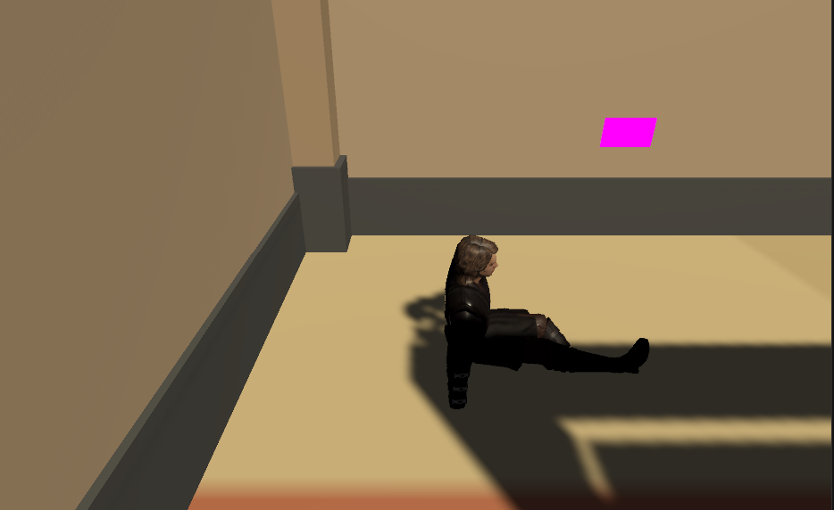
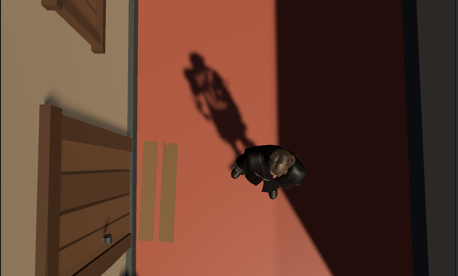
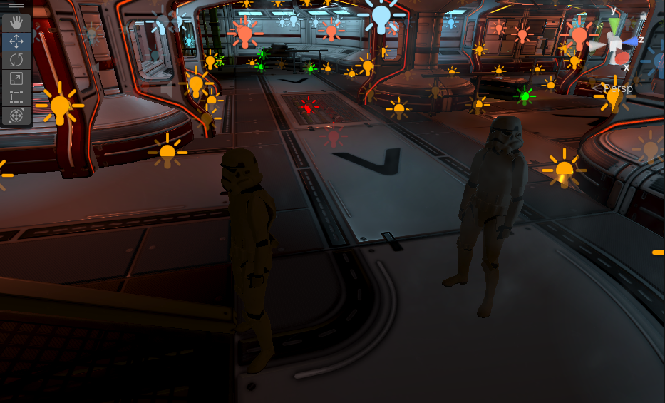
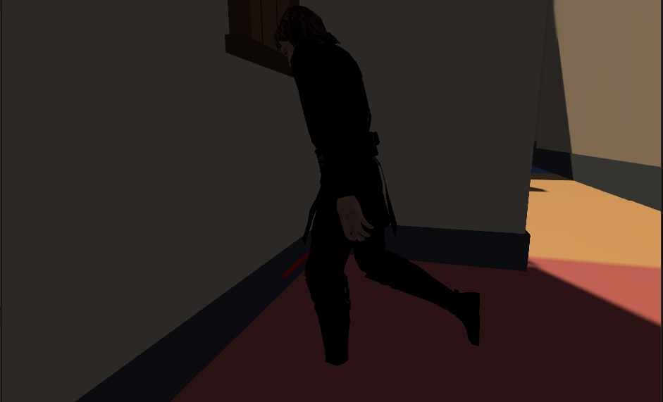

🌌 El Regreso d'Anakin

> Un joc creat amb Unity sobre l'inici d'una nova etapa d'Anakin Skywalker, quan desperta al petit poble on va créixer i comença a recuperar els seus records.

## 🎮 Descripció

En aquest joc, **Anakin es desperta** en un petit poble misteriós del seu passat. Sense saber com hi ha arribat, haurà de:

1. **Explorar el poble** i buscar un **sabre làser**.
2. Quan el troba, surt una nova animacio on el teletransporta a la **nau espacial** i Anakin és transportat.
3. A la nau, haurà de **lluitar contra els stormtroopers**.
4. En arribar a una **cadira misteriosa**, es desencadena una cinemàtica on **recorda tot el seu passat** i **contempla l'immens espai** que l'envolta.

## 🕹️ Controls

- **WASD** – Moure's
- **Ratolí** – Mirar

## 🧰 Tecnologies utilitzades

- [Unity](https://unity.com/)
- C# per la lògica del joc
- Asset packs per escenaris, personatges i efectes

## 📸 Captures de pantalla

### 🌄 Poble inicial



### ⚔️ Scool Troopers


### 🪑 Sable Laser



## 📂 Instal·lació (per desenvolupadors)
```bash
git clone https://github.com/leilachahbouni/JocRecu.git
cd JocRecu
# Obre el projecte amb Unity